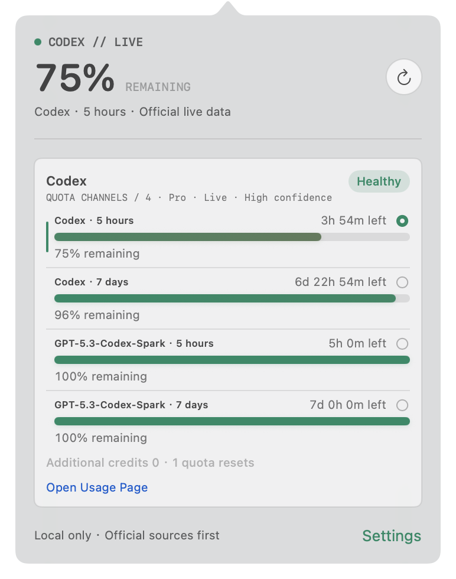

# TokenBar

**English** · [简体中文](#简体中文)

[](https://github.com/Eddiee-Wei/TokenBar/actions/workflows/ci.yml)
[](https://github.com/Eddiee-Wei/TokenBar/releases/latest)
[](LICENSE)
[](https://github.com/Eddiee-Wei/TokenBar/releases/latest)

TokenBar is an open-source, local-first macOS menu bar app for monitoring Codex quota. It shows every official quota window currently reported by the local Codex App Server and adapts when those windows change, including weekly and model-specific buckets, plus a 5-hour window whenever Codex provides one.

[Download TokenBar.dmg](https://github.com/Eddiee-Wei/TokenBar/releases/latest/download/TokenBar.dmg) · [All releases](https://github.com/Eddiee-Wei/TokenBar/releases)



## Highlights

- Live Codex quota windows exactly as reported, including weekly, model-specific, and 5-hour windows when available.
- A battery-style menu bar indicator whose fill and color follow the selected quota.
- Click any quota row to pin that window to the menu bar; the choice persists after restart.
- Exact reset countdowns, automatic refresh, low-quota notifications, and Launch at Login.
- Hold `Command + E` to peek at the popover, then release to close it.
- Custom high-quota and low-quota colors with linear-light interpolation between them.
- English by default, with Simplified Chinese available in `Settings > General > Language`.
- Compact light/dark UI that adapts to the number of returned quota windows and works across displays.

## Install

1. Download and open `TokenBar.dmg`.
2. Double-click the TokenBar icon in the installer window.
3. TokenBar installs itself in Applications and appears in the macOS menu bar.

TokenBar automatically finds the current ChatGPT/Codex app. If detection fails, it opens the Codex settings page where you can choose the app directly in Finder. A standalone Codex CLI can be selected under the advanced menu.

### First Launch on macOS

Current community builds are not Apple-notarized. If macOS says it cannot verify TokenBar:

1. Click `Done` in the warning. Do not move the app to Trash.
2. Open `System Settings > Privacy & Security` and scroll to `Security`.
3. Find the message that TokenBar was blocked, then click `Open Anyway`.
4. Authenticate with your Mac password or Touch ID, then click `Open`.
5. Launch TokenBar normally from Applications. This exception is saved for future launches.

The `Open Anyway` button is available for about one hour after the blocked launch attempt. You do not need to disable Gatekeeper or run Terminal commands. Only download TokenBar from this repository and verify the attached `SHA256SUMS`. See [Apple's official instructions](https://support.apple.com/guide/mac-help/open-a-mac-app-from-an-unknown-developer-mh40616/mac).

## Requirements

- macOS 14 or later, Apple Silicon or Intel.
- The current ChatGPT/Codex app, or a standalone Codex CLI.
- A Codex account already signed in through the selected official app or CLI.

TokenBar does not require a separate account binding and reuses your existing Codex sign-in.

## Privacy

TokenBar processes quota data only on your Mac. It does not scrape web pages, read prompts or code, inspect browser cookies, access `~/.codex/auth.json`, upload quota data, or include third-party analytics.

## Development

```bash
git clone https://github.com/Eddiee-Wei/TokenBar.git
cd TokenBar
swift test
swift run TokenBarApp
swift run tokenbar refresh
```

Create a local universal DMG:

```bash
Scripts/package-dmg.sh
open dist/TokenBar.dmg
```

See [contributing](CONTRIBUTING.md), [security](SECURITY.md), [architecture](Docs/architecture.md), [privacy](Docs/privacy.md), and [release instructions](Docs/releasing.md).

## Open Source

TokenBar is licensed under the [MIT License](LICENSE). Contributions are welcome through issues and pull requests. See [NOTICE](NOTICE) for copyright and trademark information.

TokenBar is an independent project and is not affiliated with, endorsed by, or sponsored by OpenAI.

---

## 简体中文

TokenBar 是一个开源、本地优先的 macOS 菜单栏 Codex 额度工具。它会动态展示 Codex 官方本机 App Server 当前返回的全部额度窗口，包括每周、模型独立额度，以及服务端提供时的 5 小时额度。

[下载 TokenBar.dmg](https://github.com/Eddiee-Wei/TokenBar/releases/latest/download/TokenBar.dmg) · [全部版本](https://github.com/Eddiee-Wei/TokenBar/releases)

## 主要功能

- 按 Codex 当前返回结果实时展示每周、模型独立额度，以及可用时的 5 小时额度。
- 电池式菜单栏图标，填充量和颜色跟随当前选中的额度。
- 点击任意额度行即可固定到菜单栏，重启后仍保留选择。
- 提供重置倒计时、自动刷新、低额度通知和开机启动。
- 默认按住 `Command + E` 查看浮窗，松开后关闭。
- 可设置高额度与低额度两种端点颜色，并使用线性光插值平滑过渡。
- 软件首次安装默认英文，可在`设置 > 通用 > 语言`中切换为简体中文。
- 支持深浅色、多显示器，并根据实际额度窗口数量自动调整浮窗高度。

## 安装

1. 下载并打开 `TokenBar.dmg`。
2. 双击安装窗口中央的 TokenBar 图标。
3. TokenBar 会安装到“应用程序”并出现在菜单栏。

TokenBar 会自动寻找新版 ChatGPT/Codex 应用。检测失败时会打开 Codex 设置页，可直接在访达中选择应用；独立 Codex CLI 位于高级菜单中。

### macOS 首次启动

当前社区构建尚未经过 Apple 公证。如果 macOS 提示无法验证 TokenBar：

1. 在警告窗口点击`完成`，不要将 App 移到废纸篓。
2. 打开`系统设置 > 隐私与安全性`，向下滚动到`安全性`。
3. 找到“已阻止使用 TokenBar”的提示，点击`仍要打开`。
4. 使用 Mac 密码或 Touch ID 验证，再点击`打开`。
5. 之后可从“应用程序”正常启动 TokenBar，系统会记住这次例外。

`仍要打开`按钮通常只会在首次尝试启动后保留约一小时。无需关闭 Gatekeeper，也无需执行终端命令。请只从本仓库下载 TokenBar，并核对 Release 附带的 `SHA256SUMS`。详见 [Apple 官方说明](https://support.apple.com/zh-cn/guide/mac-help/mh40616/mac)。

## 使用条件

- macOS 14 或更高版本，支持 Apple Silicon 和 Intel。
- 已安装新版 ChatGPT/Codex 应用，或独立 Codex CLI。
- 已在所选官方应用或 CLI 中登录 Codex。

TokenBar 不需要单独绑定账号，会复用你现有的 Codex 登录状态。

## 隐私

额度数据只在当前 Mac 处理。TokenBar 不抓网页、不读取 prompt、代码、浏览器 Cookie 或 `~/.codex/auth.json`，不上传额度数据，也不包含第三方统计 SDK。

## 开源与贡献

TokenBar 使用 [MIT License](LICENSE) 开源，欢迎提交 Issue 和 Pull Request。版权和商标说明见 [NOTICE](NOTICE)，贡献规范见 [CONTRIBUTING.md](CONTRIBUTING.md)，安全问题请按 [SECURITY.md](SECURITY.md) 私下报告。

TokenBar 是独立开源项目，与 OpenAI 不存在隶属、背书或赞助关系。
